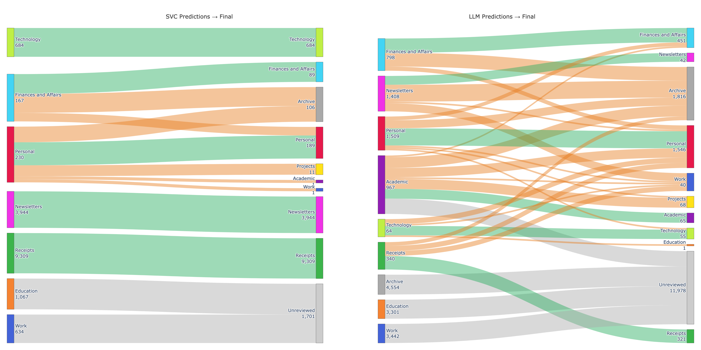
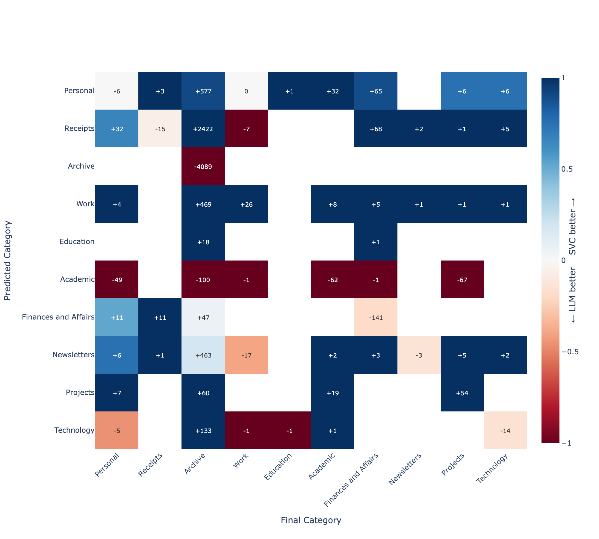

The previous parts outlined the role of text embeddings and the SVC (Support Vector Classifier) to draw boundaries between groups. This requires labelled examples (e.g. here are 9,933 receipts, here are 748 work emails), and it finds the hyperplane that separates each category from the rest with the maximum possible margin. When a new email arrives, its embedding is computed and the classifier checks which side of those boundaries it falls on.

This requires a pre-labelled training set, so I went off and manually sorted 6000-odd emails, covering the last 2 years[^1], into 10 categories. That took a couple of hours; training the model with a held-out validation set[^2] took under a minute.

## Validation

: Accuracy of SVC Classification Models

| Category             | Precision | Recall |    F1 |
| -------------------- | --------: | -----: | ----: |
| Technology           |     0.996 |  1.000 | 0.998 |
| Newsletters          |     0.966 |  0.990 | 0.978 |
| Receipts             |     0.953 |  0.964 | 0.958 |
| Finances and Affairs |     0.938 |  0.884 | 0.910 |
| Personal             |     0.895 |  0.879 | 0.887 |
| Work                 |     0.873 |  0.899 | 0.886 |
| Education            |     0.836 |  0.754 | 0.793 |

:::column-margin
**Precision** is the classifier term for **positive predictive value**. When the classifier says a message is a receipt, how likely was it to be a receipt?

**Recall** is the classifier term for **sensitivity**. Of all the receipts, what proportion did the classifier label as receipts?

The **F1** is the **harmonic mean** of precision and recall, and penalises imbalance between precision and recall.

$ F1 = 2 \times \frac{Precision \times Recall}{Precision + Recall}$
:::

Overall accuracy on the held-out validation set was **94.67%**. Notably:

* **Technology** is near-perfect. These came from a small set of distinctive sender domains with consistent vocabulary — the classifier had an easy time.
* **Education** has a precision of 0.84 but a recall of 0.75: the classifier is right when it predicts Education, but it's missing 25% of actual Education emails, most likely classifying them as Work. There's genuine semantic overlap between college correspondence and work emails, which isn't always clear in the text embeddings.

## Threshold Calibration

Although the headline figure of 94.67% is impressive, the actual important numbers are the category predictors. Because I care about accurate classification of some emails more than others (e.g. accurate classification of Projects is important to me, Newsletters not so much), I set a per-category confidence threshold. Below that threshold, the prediction is ignored and the email is deferred to the LLM.

: Calibration Thresholds to Determine SVC vs Local Language Model Classification

| Category             | Target | Threshold | Precision | Coverage |
| -------------------- | -----: | --------: | --------: | -------: |
| Receipts             |    90% |      0.50 |     95.3% |   100.0% |
| Newsletters          |    75% |      0.52 |     96.6% |   100.0% |
| Personal             |    95% |      0.90 |    100.0% |     1.8% |
| Technology           |    95% |      0.61 |     99.6% |   100.0% |
| Finances and Affairs |    95% |      0.88 |    100.0% |    22.2% |
| Work                 |    95% |      0.91 |    100.0% |     9.8% |
| Education            |    95% |      0.83 |     96.4% |    50.9% |

There is quite a bit in this table! The classifier is so confident about receipts that it needs only 45% probability to meet a 90% precision target, and covers 100% of receipts in the validation set. SVC never doubts a receipt.

Conversely, the classifier covers only 9.8% of Work emails in the validation set, passing 90.2% to the LLM to classify. Work emails look too similar to something else for the SVC to be confident in categorising them. It makes sense to me that there is no clean hyperplane through "work emails", because work emails don't cluster cleanly. The high threshold is not a failure of calibration; this reflects that those categories are based on more than just semantic embeddings.

## Local Language Model Fallback

Emails below their category's confidence threshold (plus Archive and Academic, which are excluded from SVC training entirely) were classified by `Gemma-3-12B`[^3].

The LLM received each email's subject, sender, body, and date, along with a system prompt containing category definitions. It returned a predicted category, a confidence estimate[^4], and a brief justification.[^5] On the validation set the overall LLM fallback rate was 23.9%; this increased massively to 52.7% on the full corpus.

: Comparison of SVC and LLM for Classification, by Category

| Category             |   SVC |   LLM | Total |
| -------------------- | ----: | ----: | ----: |
| Receipts             | 2,821 |    14 | 2,835 |
| Newsletters          | 2,575 |    49 | 2,624 |
| Personal             |   773 |   552 | 1,325 |
| Technology           |   369 |    29 |   398 |
| Finances and Affairs |   809 |    57 |   866 |
| Work                 |    19 | 3,012 | 3,031 |
| Education            |    11 | 2,562 | 2,573 |
| Academic             |     0 |   730 |   730 |
| Archive              |     0 | 1,362 | 1,362 |

Work and Education account for 5,573 of the 8,473 LLM classifications — 65% of the total LLM load — despite being 3.4% of the training set. This is reflective of how the *nature* of email I received over the last few years has changed - selection bias in action. The system was working as designed - it just meant that a lot more of the messages were classified by local language model than SVC.

## On Review

I used a Streamlit to show the database, and approve or reject categories based on the sender, subject, and opening lines of the message[^6]. One thing that became apparent to me during the review process was that there was need for a "Projects" category, to cover research and academic work. This was a cursory review rather than a detailed evaluation, and I am sure I would have misclassified messages during this process.

This process of manual review was important to both be confident that the classifiers were working, but also to evaluate how they each performed across different categories. This Sankey Diagram neatly demonstrates something that was obvious to me during the review process - SVC classification was highly reliable *for the messages that it reviewed*. Receipts and Newsletters predicted with 100% acceptance — not a single one needed moving. The notable exception was Finances and Affairs, where over half were reclassified. A lot of these were notifications from financial institutions (e.g. "your bank statement is ready for review") - semantically financial content that was contextually better off in the archive.

{.column-page}

The second panel tells a different story. Of 4,405 reviewed LLM predictions, 2,005 were reassigned (45.5%). The large grey[^7] Unreviewed set in the LLM panel represents 11,978 emails that were classified but never moved — predominantly Work (3,012) and Education (2,562), which together accounted for 65% of the total LLM load. The assigned categories for this group were quite poor, and I did not relish the thought of teasing these out manually.

There's an implicit assumption with this design that the language model is 'better' than the SVC for the task. That many more LLM-classified emails were manually reclassified may reflect a failure of the LLM, or simply that the LLM had only been deployed for tricky cases and SVC classification would have been more unreliable.

To tease this out, I made a heatmap which compared the predicted category from both SVC and LLM with the final accepted category after review[^8]. Predicted category is shown on the y-axis, and final category (after review) is shown on the x-axis. Colours represent whether the SVC model or the LLM were more predictive of final category - bluer tones indicate SVC outperforming the LLM, and redder tones indicate the LLM outperforming the SVC. Labels within the heatmap indicate the number of emails in each predicted/accepted category pair.

{.column-body-outset}

My read here is that the LLM was out-classed by the SVC in handling uncertain cases almost across the board. Formulaic emails, like receipts, remained dominated by the SVC even when the SVC was less confident. The categories where the LLM performed better were Archive and Academic (both excluded categories for the SVC model, so the LLM would always outperform in those), and in Finances and Affairs, where the SVC model had weaker precision and recall (as identified in the training set). This relationship held true even at lower (<0.7) levels of SVC confidence.

That said - I was pretty happy with the first pass. Where it worked, it worked very well, and the thousands of formulaic emails were handled cleanly. Work and Education remained the SVC's blind spots and fell almost entirely to the LLM, which did not handle these to an acceptable standard. After fourteen hours of compute, I now had a labelled set larger than the unlabelled set. My initial intuition was that I may be able to use the larger set to bootstrap a better classifier to sort the remainder. The answer, it turned out, rounded to no.

---

[^1]: There is obviously selection bias with this approach, but given the point of this exercise was classification, my rationale was that was happy to accept poorer classification on older, less-relevant emails, in exchange for better classification on the most recent ones. This caused problems, later.

[^2]: Archive and Academic were excluded from SVC training. Archive is a temporal and contextual category, not a semantic one, and there's no reliable SVC boundary for it. Academic had only 81 examples in my set, too few for calibration to be meaningful. Both went exclusively to the LLM. A better choice may have been to find older Academic emails and use the SVC to categorise these too.

[^3]: Gemma 3 12B is a 12-billion parameter open model from Google, available through Ollama for local inference. On my M1 Max it takes somewhere between 500ms and 15s to classify an email. It was selected due to its very high performance in classification tasks.

[^4]: The confidence estimate was a mistake - it consistently returned 0.85 in all cases.

[^5]: I experimented with passing a few 'few-shot' example emails into the prompt as well, but this consumed a lot of additional tokens, and on manual review the few-shot examples were so different to the email being classified that I was not convinced it was helpful, so I removed them.

[^6]: If doing this again, I would trim the email body further (to the first paragraph or so), which would also have the effect of increasing the weight of the sender and subject in the semantic embedding.

[^7]: The SVC panel has its own smaller grey band (1,701 emails) — these were emails that were below the SVC threshold for classification, but overflowed the LLM's context window and so did not get a category assigned by the LLM.

[^8]: Note that this subset only contains emails that didn't meet the threshold for SVC classification alone.