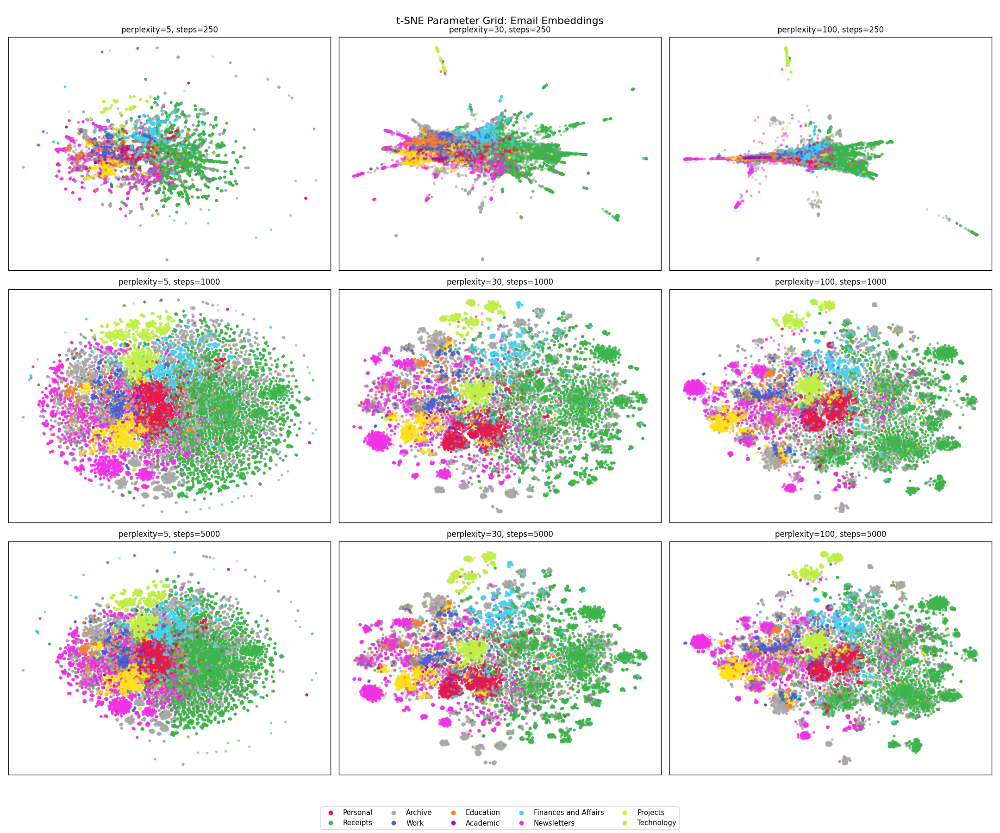

The step to classify anything is clean data in a usable form. 

I first tried extracting emails from Apple Mail using a small AppleScript bridge[^1]. This would connect to Mail, iterate over each account's mailboxes, pull subject, sender, body (capped at 6,000 characters), date received, and attachment flags, then store everything in a SQLite database — one row per email, with columns for metadata, raw text, the category label where known, and later the embedding and classification result.

It immediately became apparent that pulling emails one-at-a-time was a poor approach for extracting 50,000 emails. The better option is to pull from the Apple mail disk store directly with Python's `email` library. This process took a few minutes to pull the entire corpus into a single SQLite database.

## Generating Embeddings

The next step was to turn the email corpus into something that the models could do meaningful work on.

An embedding model[^2] takes a piece of text and produces a fixed-length numeric vector — a point in a high-dimensional space. Similar pieces of text should produce vectors that are closer together. "Your Uber receipt" and "eBay: Order confirmed" will land close together. "Your Uber receipt" and "Dear Jake, about that patient you saw last week..." will be further apart.

The model used here is `nomic-embed-text`, running locally via Ollama. The model ran blisteringly fast on my laptop, and generated embeddings for almost all[^3] emails in the corpus in a few minutes.

Before embedding, each email is preprocessed into a single text string:

```python
f"{subject} {subject} {subject} From: {sender_domain} {sender_domain} {sender_domain} {body}"
```

One of the things I realised early on is that the email subject and sender domain will be hugely predictive of the final category, compared to the body of the email. This is a true property of the problem, but won't be picked up by the embedding. The simple approach here was to repeat subject and sender in order to bias the embedding model towards those properties[^4].

:::column-margin
Sender domain is a strong signal on its own:

| Domain                  | Category    | Match % |
|-------------------------|-------------|---------|
| criticalcarereviews.com | Newsletters | 99.6%   |
| paypal.com.au           | Receipts    | 99.7%   |
| uber.com                | Receipts    | 99.8%   |
| news.bloomberg.com      | Newsletters | 100.0%  |
| ebay.com.au             | Receipts    | 98.2%   |
:::

For the supervised learning approach, I ended up deciding on the following categories:

| Category                 | Description                                                                                                                                                                                                           |   |
|--------------------------|-----------------------------------------------------------------------------------------------------------------------------------------------------------------------------------------------------------------------|---|
| **Archive**              | Emails from any category (except receipts) that are "complete" — restaurant bookings, shipping notifications, automated messages, anything that's been dealt with and kept, but not important enough to go elsewhere. |   |
| **Receipts**             | Purchase confirmations, payment records, delivery notifications. Very easy to classify; more on this later.                                                                                                           |   |
| **Newsletters**          | Publications, digests, industry updates. Includes medical journals, financial commentary, Kickstarter campaigns.                                                                                                      |   |
| **Personal**             | Correspondence with actual people in a personal context. Family, friends, colleagues writing informally.                                                                                                              |   |
| **Technology**           | Emails related to software and application development.                                                                                                                                                               |   |
| **Finances and Affairs** | Personal financial correspondence — tax, property, investments, legal.                                                                                                                                                |   |
| **Work**                 | Clinical employment. Rostering, credentialing, job applications, administrative emails from hospitals.                                                                                                                |   |
| **Education**            | Postgraduate training and assessment through medical colleges, course attendance.                                                                                                                                     |   |
| **Academic**             | Graduate coursework correspondence. Tiny category (81 emails); handled differently from the rest.                                                                                                                     |   |

### What Does Embedding Look Like?

The embedding space has 768 dimensions, which isn't directly visualisable. t-distributed stochastic neighbor embedding (t-SNE) is a technique to faithfully represent the *local* higher dimensional relationships in a two-dimensional plane. This is a non-linear transformation and so different regions of the figure may be transformed differently, clusters that appear far apart may not be, and different hyperparameters can drastically change the appearance (and interpretation) of the figure[^5]. A faceted plot shows this neatly.

{.column-body-outset}

The takeaways from this to me are:

* **Receipts** is robust to changes in perplexity across converged plots, which makes sense to me as these emails tend to have very consistent, formulaic structures.
* **Newsletters** are semantically distinct and consist of several subregions, which also fits! Money Stuff will cluster together, and away from Critical Care Reviews.
* **Archive** is scattered all over the place, which reflects its function — it's more of a temporal category than a semantic one. Poor category separation is not surprising to me — an email from a hospital that's been read and filed might be Work, Education, Projects, or Archive depending on its content and context — and that distinction requires reading it.
* **Work** does not cluster well, which makes sense to me as well, work emails feel like they will fall semantically adjacent to Education and Academic; and over-weighting sender domains and subject may not help resolve this.

Whilst the text classification works in many cases, it won't work in all - I need something that is more content and context sensitive. Which brings us to part 3, the classifier.

---

## A Brief Word on Unsupervised Learning

The siren song to avoid any manual training effort and have the classifier identify categories was strong, and was my first approach. This involved generating text embeddings for all of the emails (as described above), use a clustering algorithm to find the natural groupings, and use those groupings as email categories. If the emails cluster meaningfully without supervision, you get the structure for free.

The downside risk of this approach is that the clusters may not be *meaningful*. Even if messages are separated into neat groups but if they aren't intuitive *to me* then the utility of this approach is questionable[^6].

I tried three different embedding models — `nomic-embed`, `qwen-embed`, and `snowflake-embed` — across a range of cluster counts from k=2 to k=30[^7]. To evaluate results, a local language model (`granite-3.2`) was asked to label each cluster based on the embeddings[^8]:

: Labels generated by granite-3.2, for cluster k=10

| Cluster | nomic-embed                              | qwen-embed                              | snowflake-embed              |
| ------- | ---------------------------------------- | --------------------------------------- | ---------------------------- |
| 0       | Medical                                  | Financial transactions and statements   | Professional communication   |
| 1       | Uber orders and other                    | Professional development and networking | Miscellaneous Emails         |
| 2       | Alfred Health communications             | Multi source feedback                   | Miscellaneous" (Rev          |
| 3       | Student communications                   | Medical & Admin                         | Order/Shipment               |
| 4       | Australia...                             | Miscellaneous                           | Travel & Admin               |
| 5       | Personal & Transaction                   | Account Security                        | Alfred Health communications |
| 6       | Personal and professional correspondence | Tech Support                            | Medical meetings and updates |
| 7       | Work & Finance                           | Promotional offers" -                   | Defence Health Updates       |
| 8       | Online shopping & receipts               | Medical research & communication        | Financial and Business       |
| 9       | Miscellaneous                            | Order Confirmation/Tracking             | Professional communication   |

The truncations are real. "Miscellaneous" appears three times across the three models, which is not a useful category. "Alfred Health communications" appears in both cluster 2 (nomic) and cluster 5 (snowflake) — the model has found two genuinely different kinds of Alfred Health email and separated them, where both a subsets of a more meaningful (work) category[^9].

This isn't (at least, as far as I understand) a problem with the embedding model. Clustering finds statistical regularities in the data, and the regularities it finds are real — these emails do occupy distinct regions of the embedding space. But those regions don't necessarily correspond to the sort of categories I am after. "Alfred Health communications" appears in two clusters because there are two kinds: rostering messages, and clinical messages. The clustering algorithm correctly identified this distinction, it's just not one that is meaningful to me as both belong in Work.

It's likely that some improvements could have been made to the unsupervised learning approach, but I didn't pursue these further because it didn't feel like a fruitful avenue, and went with the supervised approach, described above.

---

[^1]: This attempt used Python's `ScriptingBridge` bindings, which expose the macOS scripting interface to Apple Mail. It's functional. The `mail_extractor.py` script handles deduplication via a unique mail ID, progress tracking, error logging, and checkpoint resumption.

[^2]: I found [this StackOverflow blog](https://stackoverflow.blog/2023/11/09/an-intuitive-introduction-to-text-embeddings/) piece very helpful for understanding text embeddings.

[^3]: The `nomic-embed-text` model has an input token limit of 8192. [One paragraph is loosely 100 tokens](https://help.openai.com/en/articles/4936856-what-are-tokens-and-how-to-count-them), which means long emails (particularly threaded emails) overran the buffer. I ignored the few hundred emails in this category and classified them manually at the end.

[^4]: I did not test different subject weights and pick the one that produces the best downstream classification performance, though I could see that being worthwhile on a more important problem.

[^5]: I found [this article](https://distill.pub/2016/misread-tsne/) from the Google Brain team to be useful to understand some of the footguns associated with t-SNE.

[^6]: This parallels what I think is the main advantage the hybrid clinician-scientist brings to research in general - an understanding of what the data is actually representing, and how results can be applied meaningfully in practice.

[^7]: These models were chosen because [Winthrop Gillis]( https://wingillis.github.io/posts/2025-02-17-email-categorization/) had demonstrated success with these in an identical task, and they dominated the [Huggingface leaderboard](https://huggingface.co/spaces/mteb/leaderboard) at the time.

[^8]: The prompt given was:
    
    "Below are {len(email_samples)} emails from a cluster:<br>
    {emails_text}<br>
    What 1-3 word label should be used to group these emails? Reply with ONLY the label, no explanation. It is VERY IMPORTANT that the label is ONLY 1-3 words in length."

[^9]: On writing this up, I realise the non-conformity of model outputs to the specification could have been enforced using `pydantic`, which forces the model to conform to a structured output by limiting the tokens it can generate in a response.
